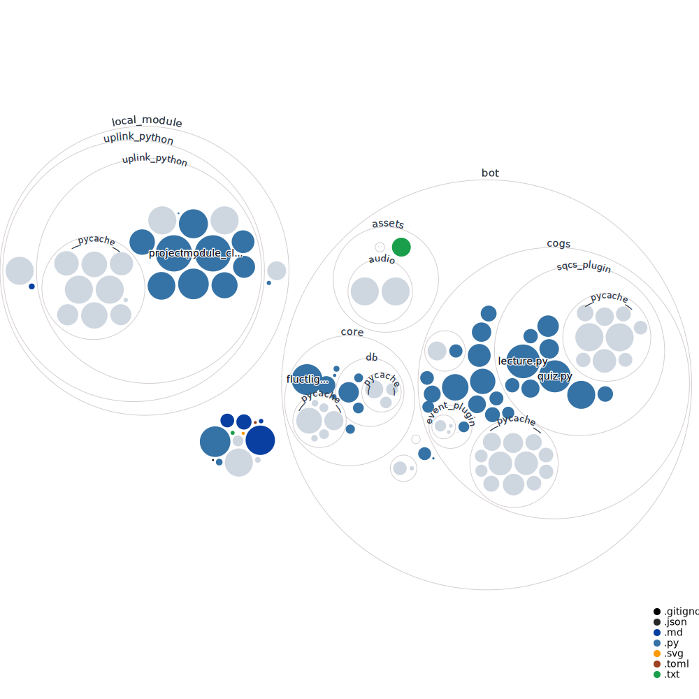

# SQCS Bot

## 🔧 Developer

- Programed and run by `@phantom0174`, made with ❤️️
- Contributors: `@qiaoyi213`

## ☘️ Introduction

- This bot handles comprehensive tasks in [SQCS](https://sqcs.ckcsc.net) Discord Guild.
- Inspired by [the tutorial](https://youtube.com/playlist?list=PLSCgthA1Anif1w6mKM3O6xlBGGypXtrtN) from `@Proladon`.

## ✅ Open-source

- Everyone is welcome to contribute to the project. For further information, please see CONTRIBUTE.md.
- The developer spend lots of time on it, so even it isn't necessary to cite the source while using relevant data, the developer will thank you if doing so.

## 📃 Command list

- There's a brand-new document for commands, check [it](https://github.com/phantom0174/SQCS_bot/blob/main/command_list.md) out!

## 💖 Thanks

- Thanks for `@esenciamorii`, who gave me the chance to learn Discord Bot.
- Thanks for all contributors to this project.
- Thanks for the lecture from `@Proladon`.
- Thanks for the help from members in Shelter-Zone.
- Thanks for the channel-protecting concept from `@BłÜɪᴄᴇ.#1015 (Discord Name)`'s discord bot - `PRØ-TECTER`

## A Codebase Visualization

